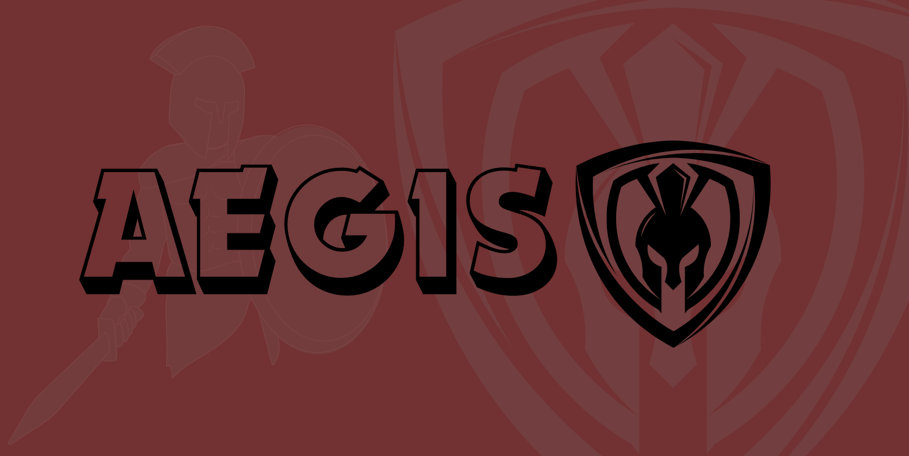

<!-- PROJECT LOGO -->
 
<h1 align="center">Aegis: Protecting Smart Contracts with AI</h1>

  
  

    Aegis is a smart contract audit and analysis tool powered by artificial intelligence, dedicated to safeguarding your Solidity code from vulnerabilities.
   
     
    <a href="">View Demo</a>
    ·
    <a href="https://github.com/KarthikS373/tea">Report Bug</a>
    ·
    <a href="https://github.com/KarthikS373/tea">Request Feature</a>
  

<!-- TABLE OF CONTENTS -->

  
<h2> Table of Contents </h2>

  <ol>
    <li>
      <a href="#abouttheproject"> About The Project </a>
      <ul>
        <li><a href="#mission"> Mission </a></li>
        <li><a href="#valueproposition"> Value Proposition </a></li>
      </ul>
    </li>
    <li><a href="#keyfeatures">Key Features</a></li>
    <li><a href="#builtwith">Built With</a></li>
    <li>
      <a href="#gettingstarted">Getting Started</a>
      <ul>
        <li><a href="#installation">Installation Instructions</a></li>
        <li><a href="#example">Example Usage</a></li>
      </ul>
    </li>
    <li><a href="#clicommands">CLI Commands</a></li>
    <li><a href="#license">License</a></li>
    <li><a href="#team">Team Members</a></li>
  </ol>

<h2 id="abouttheproject"> About the Project </h2>

Aegis is a cutting-edge smart contract audit and analysis tool, empowered by state-of-the-art artificial intelligence, that safeguards your Solidity code against a wide range of vulnerabilities. Traditional security approaches like manually defining patterns are time-consuming, require deep expertise, and struggle to keep up with ever-evolving threats. Aegis leverages the power of deep learning to offer a faster, more comprehensive solution.

<h3 id="mission"> Mission </h3>

Our mission is to empower developers of all skill levels with advanced security capabilities, simplifying the process of building robust and trustworthy smart contracts.

<h3 id="valueproposition"> Value Proposition </h3>

- **AI-powered Vulnerability Detection:** Our robust machine learning model, trained on extensive real-world data, accurately identifies critical vulnerabilities, exceeding the limitations of traditional rule-based approaches.
- **Solidity Expertise:** Aegis seamlessly supports Solidity, the leading language for smart contract development, ensuring compatibility with your existing projects.
- **Actionable Insights and Remediation:** Detailed reports pinpoint vulnerabilities, their severity levels, and offer concrete suggestions for remediation, guiding you towards secure and reliable smart contracts.
- **Effortless Integration:** Aegis integrates seamlessly into your development workflow with a user-friendly command-line interface, minimizing disruption and maximizing efficiency.

(<a href="#readme-top">back to top</a>)

<h2 id="keyfeatures"> Key Features </h2>

- **Advanced Vulnerability Detection:** Identify a broad spectrum of vulnerabilities, including reentrancy, integer overflow, access control issues, and more.
- **Comprehensive Solidity Support:** Analyze and scan your Solidity code for potential threats.
- **Actionable Insights and Remediation:** Receive detailed reports highlighting vulnerabilities, their severity levels, and suggested fixes.
- **Easy Integration:** Seamlessly integrate Aegis into your development workflow with a user-friendly CLI interface.

(<a href="#readme-top">back to top</a>)

<h2 id="builtwith"> Built with </h2>

- Programming Languages: Python
- Machine Learning Tools: PyTorch
- Other Technologies: Git

(<a href="#readme-top">back to top</a>)

<h2 id="gettingstarted"> Getting Started </h2>

<h3 id="installation"><a href="docs/setup.md"> Installation Instructions </a></h3>
<h3 id="example"> <a href="docs/examples.md"> Example Usage </a></h3>

(<a href="#readme-top">back to top</a>)

<h2 id="clicommands"> CLI Commands </h2>

Aegis offers a set of intuitive CLI commands for efficient interaction. Refer to the [documentation](docs/examples.md) for usage examples.

(<a href="#readme-top">back to top</a>)

<h2 id="license"> License </h2>

Aegis is licensed under the [license type] license. For more information, please see the LICENSE file in the repository.

(<a href="#readme-top">back to top</a>)

<h2 id="team"> Team Members </h2>

- [Ananya Gupta](https://github.com/Ananya2003Gupta)
- [Karthik S](https://github.com/KarthikS373)
- [Samarth Sahu](https://github.com/Samcoding5854)

(<a href="#readme-top">back to top</a>)

