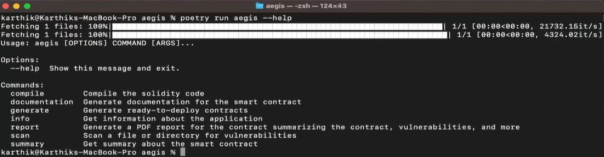
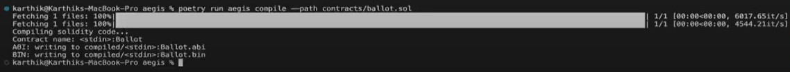
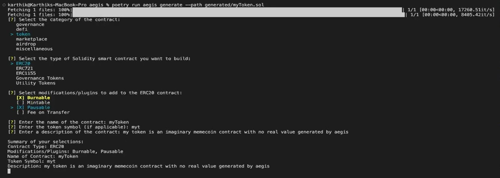
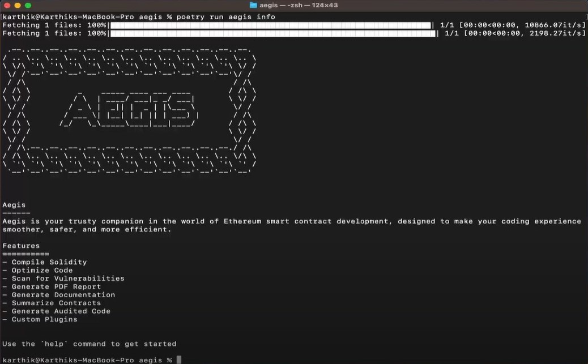
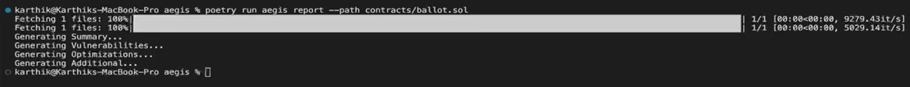
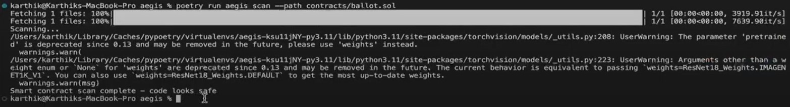
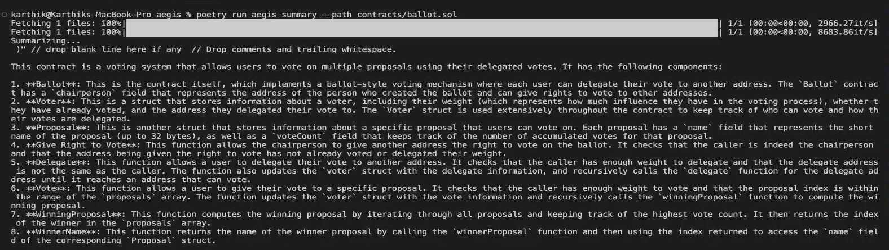

<a name="readme-top"></a>
# Example Usage

This guide provides detailed examples and explanations for essential commands to help you seamlessly compile Solidity code, generate documentation, scan for vulnerabilities, and more. Get acquainted with Aegis's functionalities and enhance your smart contract development process.

## Table of Contents
- [Prerequisite](#prerequisite)
- [List of Commands](#list-of-commands)
  - [compile](#compile)
  - [documentation](#documentation)
  - [generate](#generate)
  - [info](#info)
  - [report](#report)
  - [scan](#scan)
  - [summary](#summary)

## Prerequisite
Before you can start running or testing the commands, you need to have Aegis installed and set up on your system. If you haven't done this yet, follow the [Setup](../setup.md) guide to install Aegis on your local machine and activate the virtual environment by running ` poetry shell `.

Once you've completed the setup, run the following command to check if Aegis is properly installed on your system:
```
poetry run aegis --help
```
If you receive an output similar to the example below, it indicates that Aegis is successfully installed on your system:
<div align="center">
  <a href="assets/commands.jpeg">
    
  </a>
</div>
Now you're ready to explore and utilize Aegis through its command line interface (CLI).

<p align="right">(<a href="#readme-top">back to top</a>)</p>


## List of Commands

We'll now explore each Aegis command in detail. From compiling Solidity code to generating documentation, scanning for vulnerabilities, and more, let's break down the technical aspects of each command to enhance your understanding of Aegis tools for smart contract development, audit and analysis.

- ### compile
**Description:** compile the solidity code

**Command:** `poetry run aegis compile –-path <path_to_solidity_file>`

**Example:**
```
poetry run aegis compile --path contracts/ballot.sol
```
<div align="center">
  <a href="assets/compile.jpeg">
    
  </a>
</div>

<p align="right">(<a href="#readme-top">back to top</a>)</p>

- ### documentation
**Description:** generate documentation for the smart contract

**Command:** `poetry run aegis documentation –-path <path_to_solidity_file>`

**Example:**
```
poetry run aegis documentation –-path contracts/counter.sol
```
<div align="center">
  <a href="assets/documentation.jpeg">
    
  </a>
</div>

<p align="right">(<a href="#readme-top">back to top</a>)</p>

- ### generate
**Description:** generate ready to deploy smart contracts

**Command:** `poetry run aegis generate –-path <path_where_solidity_file_be_generated>`

**Example:**
```
poetry run aegis generate –-path generated/myToken.sol
```
<div align="center">
  <a href="assets/generate.jpeg">
    
  </a>
</div>

<p align="right">(<a href="#readme-top">back to top</a>)</p>

- ### info
**Description:** get information about the application(Aegis)

**Command:** `poetry run aegis info`

**Example:**
```
poetry run aegis info
```
<div align="center">
  <a href="assets/info.jpeg">
    
  </a>
</div>

<p align="right">(<a href="#readme-top">back to top</a>)</p>

- ### report
**Description:** generate a pdf report for the smart contract, summarizing its content, highlighting detected vulnerabilities, and suggesting optimizations

**Command:** `poetry run aegis report -–path <path_to_solidity_file>`

**Example:**
```
poetry run aegis report -–path contracts/ballot.sol
```
<div align="center">
  <a href="assets/report.jpeg">
    
  </a>
</div>

The report generated can be viewed [here](assets/report.pdf).

<p align="right">(<a href="#readme-top">back to top</a>)</p>

- ### scan
**Description:** scan a file or directory for vulnerabilities

**Command:** `poetry run aegis scan -–path <path_to_solidity_file>`

**Example:**
```
poetry run aegis scan -–path contracts/ballot.sol
```
<div align="center">
  <a href="assets/scan.jpeg">
    
  </a>
</div>

<p align="right">(<a href="#readme-top">back to top</a>)</p>

- ### summary
**Description:** get summary about the smart contract

**Command:** `poetry run aegis summary -–path <path_to_solidity_file>`

**Example:**
```
poetry run aegis summary -–path contracts/ballot.sol
```
<div align="center">
  <a href="assets/summary.jpeg">
    
  </a>
</div>

<p align="right">(<a href="#readme-top">back to top</a>)</p>
