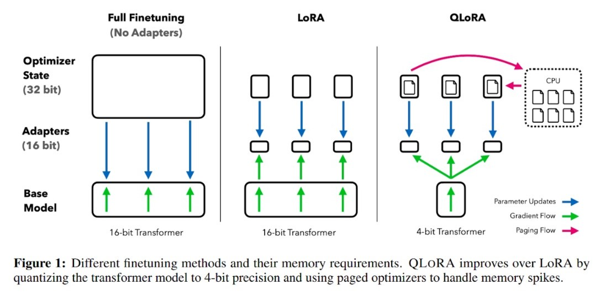

# Enhanced Problem Detection and Fixing using LLAMA 2

<!-- TABLE OF CONTENTS -->

  
<h2> Table of Contents </h2>

  <ol>
    <li><a href="#motivation"> Motivation </a></li>
    <li><a href="#dataset"> Dataset </a></li>
    <li><a href="#model"> Model </a></li>
    <li><a href="#workflow"> Solution Workflow </a></li>
    <li><a href="#advantages"> Training Results </a></li>
  </ol>

<h2 id="motivation"> Motivation </h2>

We noticed that, while the [ResNet model](ResNetModelTraining.md) can assist in identifying vulnerability types in smart contracts, it doesn't specify exactly which parts of the code are problematic or how to address them. Consequently, we decided to develop a more advanced tool. We employed a smart model called LLAMA 2, which we finetuned specifically for this purpose. LLAMA 2 not only identifies issues but also indicates the affected parts of the code and provides guidance on how to rectify them. Our goal is to aid developers and security professionals by simplifying the process of identifying and addressing vulnerabilities in smart contracts. We believe this will enhance the overall security of smart contracts by facilitating more effective issue resolution.

(<a href="#readme-top">back to top</a>)

<h2 id="dataset"> Dataset </h2>

We generated our own dataset by engaging in conversations with ChatGPT 3.5 and Bard. Subsequently, we compiled all the information they provided to train the LLAMA 2 model. This dataset exclusively consists of content from our interactions with ChatGPT and Bard, and we did not incorporate any external or sophisticated datasets. This homemade dataset played a crucial role in enhancing LLAMA 2's language understanding capabilities, enabling it to become more adept at identifying and resolving code-related issues.

(<a href="#readme-top">back to top</a>)

<h2 id="model"> Model </h2>

We employed a technique known as qLoRA to fine-tune our model, aiming to reduce memory usage while maintaining high performance. This method involves utilizing a 4-bit quantized pretrained language model in conjunction with frozen Low Rank Adapters. Our most successful model, named Guanaco, surpassed the performance of previous models in benchmark tests. Leveraging qLoRA, we fine-tuned over 1,000 models, evaluating chatbot performance and instruction following across various datasets and model types. Our findings indicate that, even with smaller models, qLoRA fine-tuning on a small dataset yields excellent results. We have made all our models and code accessible, including CUDA kernels for 4-bit training, to facilitate the replication of our work by other researchers and encourage further advancements in the field.

  

(<a href="#readme-top">back to top</a>)

<h2 id="workflow"> Solution Workflow </h2>

Our solution workflow commences with our initial model detecting vulnerabilities in contracts. In the event vulnerabilities are identified, the process triggers the Language Model (LLM) with a base prompt. If the contract is determined to be secure, the workflow yields a confirmation of its safety accompanied by a summary. This streamlined approach guarantees a comprehensive analysis of contracts for vulnerabilities. In instances where no issues are detected, users receive a distinct affirmation of safety along with a succinct summary.

(<a href="#readme-top">back to top</a>)

<h2 id="advantages"> Key Advantages </h2>

- **Precise Vulnerability Detection**: Our initial model efficiently identifies vulnerabilities in smart contracts, providing a solid foundation for further analysis.
- **Streamlined Workflow**: The seamless integration of our Language Model (LLM) into the process ensures a focused and efficient examination of flagged contracts, reducing unnecessary complexities.
- **Clear Safety Confirmation**: When contracts are deemed secure, users receive a clear affirmation of their safety, instilling confidence in the integrity of the code.
- **Concise Summaries**: The workflow generates concise summaries, offering users a quick understanding of the contract's security status without delving into intricate details.
- **Comprehensive Analysis**: The combination of vulnerability detection and LLM-based assessment ensures a thorough evaluation of contracts, addressing potential issues comprehensively.

(<a href="#readme-top">back to top</a>)
