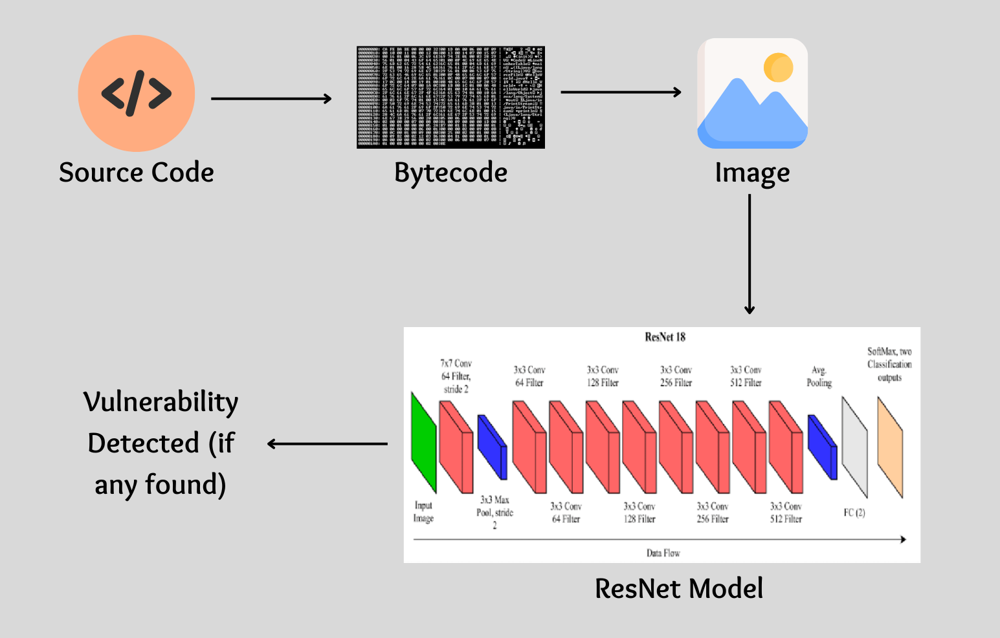

<a name="readme-top"></a>

## Training Deep Learning Model for Smart Contract Vulnerability Detection

Aegis explores the use of Deep Learning techniques for detecting vulnerabilities in Ethereum smart contracts.

<!-- TABLE OF CONTENTS -->
<details>
  <summary><h2> Table of Contents </h2></summary>
  <ol>
    <li><a href="#motivation"> Motivation </a></li>
    <li><a href="#dataset"> Dataset </a></li>
    <li><a href="#model"> Model </a></li>
    <li><a href="#workflow"> Solution Workflow </a></li>
    <li><a href="#results"> Training Results </a></li>
    <li><a href="#futurework"> Future Work </a></li>
    <li><a href="#references"> References </a></li>
  </ol>
</details>

<h2 id="motivation"> Motivation </h2>

Smart contracts written in Solidity are susceptible to vulnerabilities that can lead to the loss of funds and other digital assets. Traditional static analysis tools often rely on expert-defined rules, which may not capture all potential vulnerabilities. Aegis investigates the use of Deep Learning models, specifically Convolutional Neural Networks (CNNs), to automatically learn features from smart contract bytecode and predict the presence of vulnerabilities.

<p align="right">(<a href="#readme-top">back to top</a>)</p>

<h2 id="dataset"> Dataset </h2>

The dataset used in this project is [mwritescode/slither-audited-smart-contracts](https://huggingface.co/datasets/mwritescode/slither-audited-smart-contracts), which contains over 100k smart contracts which were labeled using the Slither static analyzer.
<br>
<br>
Slither static analyzer passes the code though a number of rule-based detectors and returns a JSON file containing details about where those detectors found a vulnerability. The 38 detectors that found a match in the dataset were then mapped to the following 5 classes that were:

- 0 : access-control :- Common in all software, Access Control flaws arise in smart contracts when functions/data lack proper restrictions, enabling unauthorized access by malicious users.
- 1 : arithmetic :- Arithmetic vulnerabilities, especially integer underflow/overflow, are risky in smart contracts due to prevalent unsigned integers. Overflows can weaponize benign code for DoS attacks or theft.
- 2 : others :- "Others" category encompasses remaining Solidity vulnerabilities like uninitialized state, incorrect equality checks, and backdoor functions.
- 3 : reentrancy :- This well-known Ethereum vulnerability occurs when an external contract call is allowed to make additional calls back to the original contract before the initial execution finishes. This can unexpectedly alter the contract's state during function execution, creating security risks.
- 4 : safe :- the code is free from vulnerabilities
- 5: unchecked-calls :- Solidity offers some low-level functions like call(), callcode(), delegatedcall() and send() which do not propagate errors. These functions simply return false, but the code will continue to run; thus developers should always check the return value of such low-level calls.

<p align="right">(<a href="#readme-top">back to top</a>)</p>

<h2 id="model"> Model </h2>

The model used is a ResNet-18 pre-trained on ImageNet and fine-tuned on the smart contract bytecode images. The bytecode is converted into RGB images using a specific encoding scheme.Suppose we have the piece of bytecode 606080, then in the RGB image the three channels will be (R:60, G:60, B:80). When passing them as input to our model we actually center crop and resize them in order to achieve a single image size.

```
======================================================================
Layer (type:depth-idx)                        Param #
======================================================================
ResNetModel                                   --
├─ResNet: 1-1                                 --
│    └─Conv2d: 2-1                            (9,408)
│    └─BatchNorm2d: 2-2                       (128)
│    └─ReLU: 2-3                              --
│    └─MaxPool2d: 2-4                         --
│    └─Sequential: 2-5                        --
│    │    └─BasicBlock: 3-1                   (73,984)
│    │    └─BasicBlock: 3-2                   (73,984)
│    └─Sequential: 2-6                        --
│    │    └─BasicBlock: 3-3                   (230,144)
│    │    └─BasicBlock: 3-4                   (295,424)
│    └─Sequential: 2-7                        --
│    │    └─BasicBlock: 3-5                   (919,040)
│    │    └─BasicBlock: 3-6                   (1,180,672)
│    └─Sequential: 2-8                        --
│    │    └─BasicBlock: 3-7                   (3,673,088)
│    │    └─BasicBlock: 3-8                   4,720,640
│    └─AdaptiveAvgPool2d: 2-9                 --
│    └─Linear: 2-10                           2,565
======================================================================
Total params: 11,179,077
Trainable params: 4,723,205
Non-trainable params: 6,455,872
======================================================================
```

<p align="right">(<a href="#readme-top">back to top</a>)</p>

<h2 id="workflow"> Solution Workflow </h2>
<div align="center">
  <a href="../../assets/SolutionArchitecture.png">
    
  </a>
</div>

<p align="right">(<a href="#readme-top">back to top</a>)</p>

<h2 id="results"> Training Results </h2>

The fine-tuned ResNet-18 model achieved the following results:

| Metric          | Train  | Validation |
| --------------- | ------ | ---------- |
| Loss            | 0.0611 | 0.4833     |
| Accuracy        | 0.9022 | 0.6500     |
| Macro F1-score  | 0.9537 | 0.7313     |
| Macro Precision | 0.9595 | 0.7753     |
| Macro Recall    | 0.9481 | 0.6934     |
| Micro F1-score  | 0.9583 | 0.7622     |
| Micro Precision | 0.9621 | 0.8017     |
| Micro Recall    | 0.9545 | 0.7264     |

These results demonstrate the potential of using Deep Learning for smart contract vulnerability detection.
<br>
Notebook Link : [Aegis Model Training](docs/training/AegisModelTraining.ipynb)

<p align="right">(<a href="#readme-top">back to top</a>)</p>

<h2 id="futurework"> Future Work </h2>
Further research is needed to improve the accuracy and generalizability of the model. This could involve exploring different Deep Learning architectures, data augmentation techniques, and incorporating information beyond the bytecode itself.

<p align="right">(<a href="#readme-top">back to top</a>)</p>

<h2 id="references"> References </h2>
[1] Huang, T. H.-D. (2018). Hunting the Ethereum Smart Contract: Color-inspired Inspection of Potential Attacks. ArXiv:1807.01868 [Cs]. http://arxiv.org/abs/1807.01868

[2] Hwang, S.-J., Choi, S.-H., Shin, J., & Choi, Y.-H. (2022). CodeNet: Code-Targeted Convolutional Neural Network Architecture for Smart Contract Vulneratbility Detection. IEEE Access, 1–1. https://doi.org/10.1109/ACCESS.2022.3162065

[3] Lin, W.-C., & Yeh, Y.-R. (2022). Efficient Malware Classification by Binary Sequences with One-Dimensional Convolutional Neural Networks. Mathematics, 10(4), 608. https://doi.org/10.3390/math10040608

[4] Durieux, T., Ferreira, J. F., Abreu, R., & Cruz, P. (2020). Empirical Review of Automated Analysis Tools on 47,587 Ethereum Smart Contracts. Proceedings of the ACM/IEEE 42nd International Conference on Software Engineering, 530–541. https://doi.org/10.1145/3377811.3380364

<p align="right">(<a href="#readme-top">back to top</a>)</p>
